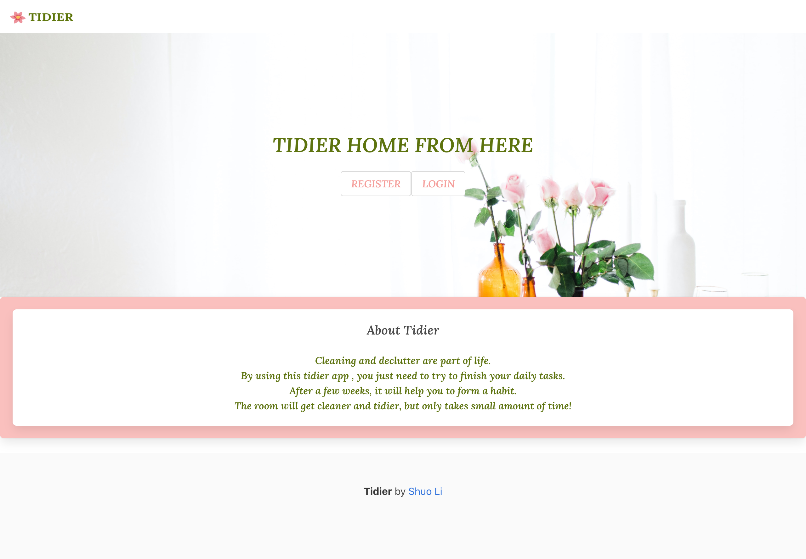
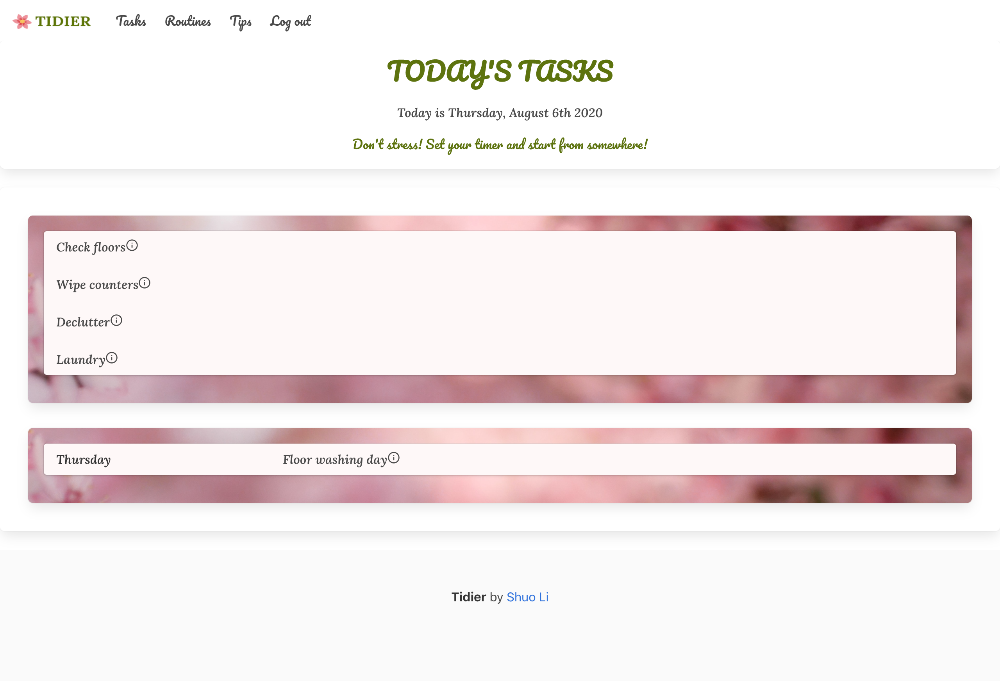
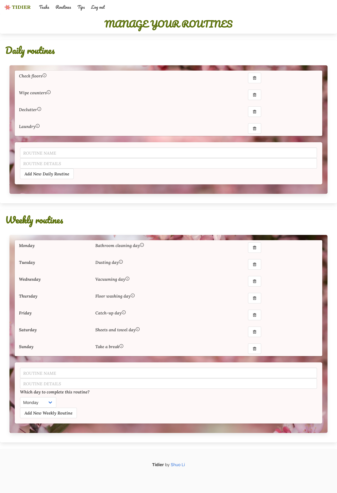

# Tidier

## Overview

Tidier is an application to help the user organise daily chores.

## Welcome Page

The user needs to register or login\

## Tasks Page

This is the page to display today's dates and tasks\

## Routines Page

This is the page where the user can manage their daily and weekly routines\

## Usage

Deployed link: <https://tidier-app.herokuapp.com/>\
Repo link: <https://github.com/lipaopao010/Tidier>

## User story

As an user\
I want to view and manage my everyday housework tasks\
So I can finish my chores in an organised way

## Technology used
MERN - Mongoose, Express, React, Node\
Bulma framework\
Passport for user authentication